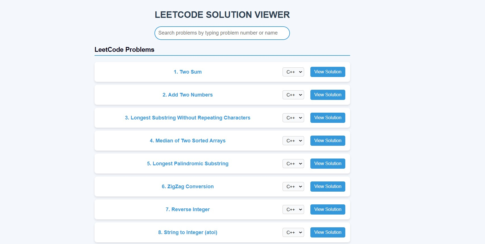
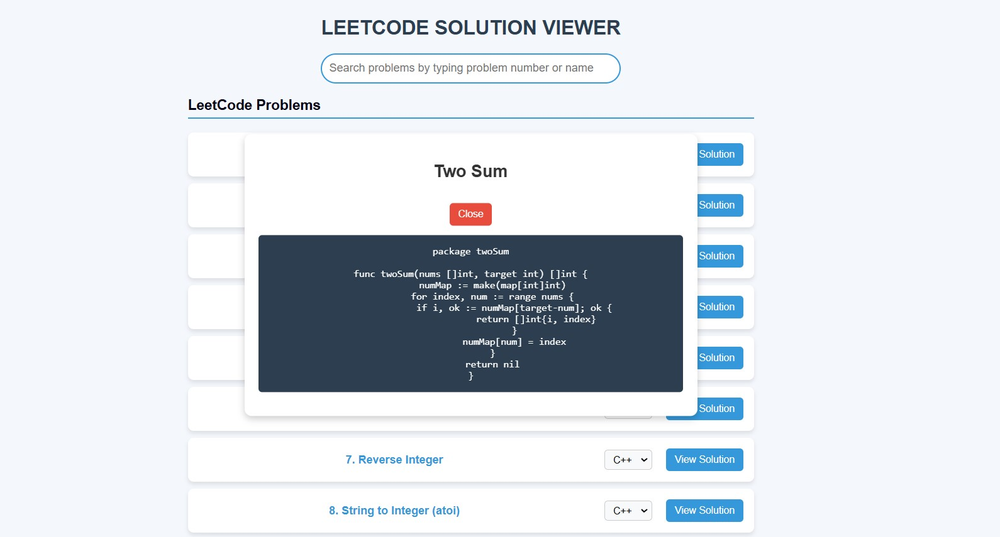

# LEETCODE SOLUTION VIEWER
## **A web-based application** which provides you with solution to all your leetcode problems just by entering the problem number or name. It also categorises solutions based on programming languages.

## **FEATURES**
1. Search for solutions by **problem number or name**
2. Solutions grouped by programming language
3. **Clickable links** to LeetCode problems
4. Responsive design to help users work across different devices

## **BRIEF TASK DESCRIPTION**
- **Tech-stacks used: HTML, CSS, JS**
- The given application fetches a README.md file (locally stored) containing LeetCode problem data. Then it parses the file and extracts problem numbers, titles, and solution links. Then problems are displayed in a categorized list (LeetCode, LintCode, LeetCode Shell).
The application allows users to select a programming language to view the corresponding solution. The solution to each problem is displayed in a dialog box.

- The given images display the interface of the website

 

 

# **INSTRUCTIONS TO RUN THE PROJECT**
Open all the 4 files- index.html, style.css, script.jss and readmeproblems.md in VS Code, under a single folder. Then download the Live Server extension. Now click on the "Go live" option at right bottom of the VS Code interface to make your web-page work. The web-page would run and then you can easily search for the required problems and access the solutions.